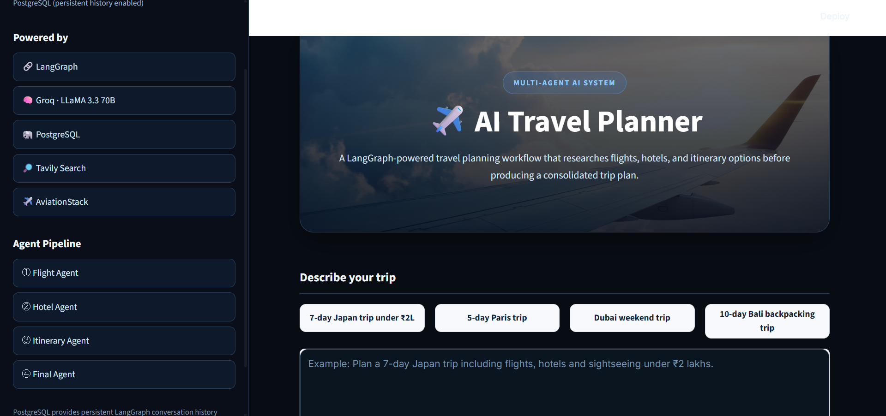
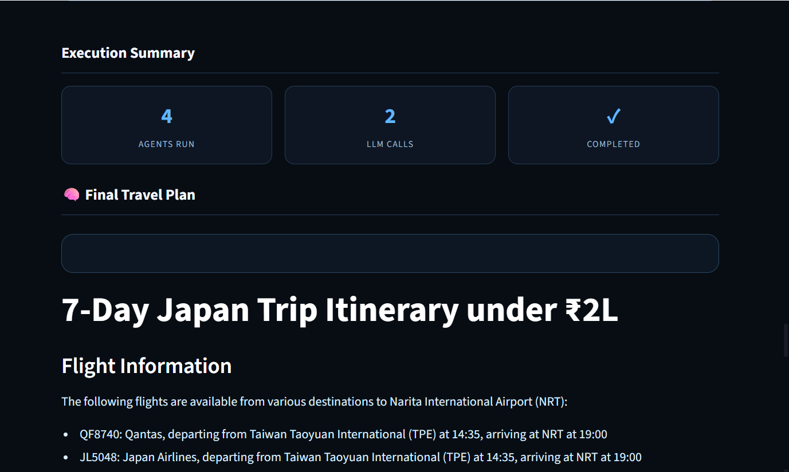

# ✈️ AI Travel Planner

### Multi-Agent AI Travel Planning System powered by LangGraph

<p align="center">
  <a href="https://travel-agent-using-langgraph-cgqznzdn2izqsdbt7blkrf.streamlit.app/">🚀 Live Demo</a>
  &nbsp;&nbsp;•&nbsp;&nbsp;
  <a href="https://github.com/sohambagdane/travel-agent-using-langgraph">💻 GitHub Repository</a>
</p>

---

## 📌 Overview

**AI Travel Planner** is a multi-agent AI application that transforms a natural-language travel request into a structured and personalized travel plan.

Instead of relying on a single LLM prompt, the application uses **LangGraph to orchestrate specialized agents**, with each agent responsible for a specific part of the travel-planning workflow.

The system integrates:

* **LangGraph** for agent orchestration and state management
* **Groq / LLaMA 3.3 70B** for LLM reasoning and generation
* **AviationStack** for flight information
* **Tavily** for web-based hotel and destination research
* **PostgreSQL / Neon** for persistent LangGraph checkpointing
* **Streamlit** for the interactive web interface

Example request:

> Plan a 5-day Japan trip from Mumbai under ₹2 lakhs including flights, hotels and sightseeing.

The application decomposes the request into multiple tasks, gathers external information, and synthesizes the results into a final travel plan.

---

# 🧠 Multi-Agent Architecture

The core of the application is a **LangGraph-based stateful workflow**.

Instead of asking one LLM to perform every task, the system separates responsibilities across specialized stages.

```text
                         USER
                           │
                           ▼
                  ┌─────────────────┐
                  │   Streamlit UI  │
                  │   frontend.py   │
                  └────────┬────────┘
                           │
                           ▼
                  ┌─────────────────┐
                  │    LangGraph    │
                  │    Workflow     │
                  │     main.py     │
                  └────────┬────────┘
                           │
              ┌────────────┼────────────┐
              │            │            │
              ▼            ▼            ▼
        ┌──────────┐ ┌──────────┐ ┌─────────────┐
        │  Flight  │ │  Hotel   │ │  Itinerary  │
        │  Agent   │ │  Agent   │ │    Agent    │
        └────┬─────┘ └────┬─────┘ └──────┬──────┘
             │            │              │
             ▼            ▼              │
        AviationStack   Tavily            │
             │            │              │
             └────────────┴──────────────┘
                           │
                           ▼
                  ┌─────────────────┐
                  │  Groq / LLaMA   │
                  │    3.3 70B      │
                  └────────┬────────┘
                           │
                           ▼
                  ┌─────────────────┐
                  │   Final Agent   │
                  └────────┬────────┘
                           │
                           ▼
                  ┌─────────────────┐
                  │   Travel Plan   │
                  └────────┬────────┘
                           │
                           ▼
                  ┌─────────────────┐
                  │   PostgreSQL    │
                  │   Checkpoint    │
                  └─────────────────┘
```

---

## 🔄 How the Workflow Works

### 1. 👤 User Request

The user enters a natural-language travel request through the Streamlit interface.

Example:

```text
Plan a 5-day Japan trip from Mumbai under ₹2 lakhs.
```

The request can contain:

* Origin city
* Destination
* Trip duration
* Budget
* Flight requirements
* Accommodation requirements
* Other travel preferences

The request becomes the initial state of the LangGraph workflow.

### 2. ✈️ Flight Agent

The Flight Agent handles flight-related research.

It identifies the origin and destination from the travel request and maps supported locations to airport IATA codes.

Example:

```text
Mumbai
   ↓
BOM

Japan
   ↓
NRT / HND
```

The agent communicates with AviationStack and retrieves available flight information.

The returned information may include:

* Flight number
* Airline
* Departure airport
* Arrival airport
* Departure time
* Arrival time
* Flight status

Implementation:

```text
tools/flight_tool.py
```

The Flight Agent also contains handling for API failures and subscription-level limitations.

#### AviationStack Free-Tier Limitation

The project uses AviationStack's free tier for demonstration.

The free tier provides access to available real-time flight information but has limitations regarding future flight schedule data.

Therefore, a request such as:

```text
Find flights from Mumbai to Japan departing tomorrow.
```

may not return future flight records.

This is an external API subscription limitation rather than a failure of the LangGraph workflow.

### 3. 🏨 Hotel Research Agent

The Hotel Agent performs web-based accommodation and destination research using Tavily.

Instead of relying entirely on the LLM's pretrained knowledge, the agent creates a destination-specific research query.

For example:

```text
best hotels in Japan
budget accommodation
mid-range hotels
luxury hotels
best neighborhoods to stay
```

Tavily returns web research results.

The application then:

* Retrieves the results
* Cleans the returned content
* Shortens excessive text
* Filters obviously irrelevant results
* Passes the useful research back into the workflow

Implementation:

```text
tools/tavily_tool.py
```

### 4. 🗺️ Itinerary Agent

The Itinerary Agent receives the original travel requirements together with information collected by the specialized agents.

The LLM then converts this information into a structured travel itinerary.

The generated itinerary can include:

* Day-by-day activities
* Sightseeing recommendations
* Accommodation suggestions
* Travel considerations
* Budget considerations
* Practical recommendations

The purpose of this stage is to transform raw research into an actionable travel plan.

### 5. 🤖 Final Response Agent

The final stage synthesizes the information produced throughout the workflow.

Conceptually:

```text
User Requirements
       +
Flight Information
       +
Hotel Research
       +
Itinerary
       ↓
Final Agent
       ↓
Structured Travel Plan
```

The final response is displayed through the Streamlit interface.

The application can also generate a downloadable Markdown travel plan.

---

## 🔗 LangGraph State Management

LangGraph maintains shared state as information moves between workflow stages.

Conceptually, the state evolves as:

```text
Initial State
     │
     ├── user_request
     │
     ▼
Flight Agent
     │
     ├── flight_results
     │
     ▼
Hotel Agent
     │
     ├── hotel_research
     │
     ▼
Itinerary Agent
     │
     ├── itinerary
     │
     ▼
Final Agent
     │
     └── final_response
```

This allows individual agents to remain focused on their responsibilities while contributing information to the final response.

---

## 💾 Persistent Memory & Checkpointing

The application supports PostgreSQL-backed LangGraph checkpointing.

The deployed version uses **Neon PostgreSQL**.

```text
                  LangGraph
                      │
                      ▼
             PostgreSQL Checkpointer
                      │
              ┌───────┼───────┐
              ▼       ▼       ▼
          Workflow   Agent  Conversation
            State    State      State
```

PostgreSQL allows workflow state to persist beyond a single in-memory execution.

The application also includes an in-memory fallback when PostgreSQL is unavailable, allowing the core application to continue operating.

---

## 🌐 Deployment Architecture

The application is deployed using **Streamlit Community Cloud**.

```text
                     GitHub
                       │
                       ▼
                Streamlit Cloud
                       │
                       ▼
                   frontend.py
                       │
                       ▼
                  LangGraph App
                       │
              ┌────────┼────────┐
              ▼        ▼        ▼
            Groq     Tavily  AviationStack
              │        │        │
              └────────┼────────┘
                       │
                       ▼
                  Neon PostgreSQL
```

API credentials are configured using Streamlit Secrets rather than being committed to the repository.

---

## 🛠️ Technology Stack

| Category               | Technology                |
| ---------------------- | ------------------------- |
| Programming Language   | Python 3.12               |
| Agent Orchestration    | LangGraph                 |
| LLM                    | Groq / LLaMA 3.3 70B      |
| LLM Framework          | LangChain                 |
| Web Research           | Tavily                    |
| Flight Data            | AviationStack             |
| Database               | PostgreSQL                |
| PostgreSQL Driver      | Psycopg                   |
| Checkpointing          | LangGraph PostgresSaver   |
| Frontend               | Streamlit                 |
| Database Hosting       | Neon                      |
| Deployment             | Streamlit Community Cloud |
| Environment Management | python-dotenv             |
| Version Control        | Git / GitHub              |

---

## 📂 Project Structure

```text
travel-agent-using-langgraph/
│
├── .env.example
├── .gitignore
├── README.md
├── requirements.txt
│
├── main.py
│   └── LangGraph workflow and application logic
│
├── frontend.py
│   └── Streamlit user interface
│
├── tools/
│   ├── __init__.py
│   ├── flight_tool.py
│   │   └── AviationStack flight integration
│   │
│   └── tavily_tool.py
│       └── Tavily hotel/destination research
│
├── screenshots/
│   ├── demo.png
│   └── demo2.png
│
└── travel_plans/
    └── Generated Markdown travel plans
```

---

## ✨ Key Features

### 🤖 Multi-Agent AI Workflow

Specialized agents divide travel planning into focused tasks instead of relying on a single monolithic LLM prompt.

### 🔗 LangGraph Orchestration

LangGraph manages agent execution, shared state, workflow transitions, and checkpointing.

### ✈️ Flight Search

AviationStack integration provides available flight information for supported routes.

### 🏨 Web-Grounded Hotel Research

Tavily provides external web research for accommodation and destination recommendations.

### 🧠 LLM-Based Reasoning

Groq-hosted LLaMA 3.3 70B handles natural-language understanding, reasoning, itinerary generation, and response synthesis.

### 💾 Persistent Workflow State

PostgreSQL and LangGraph checkpointing provide persistent state management.

### 📄 Markdown Travel Plans

Generated travel plans can be saved and downloaded as Markdown files.

### 🔐 Secure Secret Management

API keys and database credentials are loaded through environment variables locally and Streamlit Secrets in deployment.

### 🌐 Public Deployment

The application is deployed and accessible through Streamlit Community Cloud.

---

## 📸 Demo

### Travel Planner Interface



### Generated Travel Plan



---

## 🚀 Live Demo

**Launch AI Travel Planner:**

https://travel-agent-using-langgraph-cgqznzdn2izqsdbt7blkrf.streamlit.app/

The deployed application integrates:

* LangGraph
* Groq / LLaMA 3.3 70B
* Tavily
* AviationStack
* Neon PostgreSQL
* Streamlit

---

## 💡 Example Prompts

### Japan Trip

```text
I want to travel to Japan for 5 days from Mumbai.
```

### Budget-Constrained Trip

```text
Plan a 7-day Japan trip from Mumbai under ₹2 lakhs including flights, hotels and sightseeing.
```

### Paris Trip

```text
Plan a 5-day trip to Paris from Mumbai with accommodation and sightseeing recommendations.
```

### Dubai Trip

```text
Plan a weekend trip to Dubai from Mumbai.
```

### Future Flight Request

```text
Plan a 5-day Japan trip from Mumbai with flights departing tomorrow.
```

Future flight availability depends on the capabilities and subscription limitations of the AviationStack plan being used.

---

## 🔐 Environment Variables

For local development, create a `.env` file:

```env
GROQ_API_KEY=your_groq_api_key
TAVILY_API_KEY=your_tavily_api_key
AVIATIONSTACK_API_KEY=your_aviationstack_api_key
DATABASE_URL=your_postgresql_connection_string
```

For Streamlit Cloud, configure the same credentials through **Streamlit Secrets**.

### Security

Never commit credentials to GitHub.

Do not commit:

* `.env`
* API keys
* Database passwords
* Private credentials

---

## ⚙️ Local Setup

### 1. Clone the repository

```bash
git clone https://github.com/sohambagdane/travel-agent-using-langgraph.git
cd travel-agent-using-langgraph
```

### 2. Create a virtual environment

#### Windows

```powershell
python -m venv langgraph_env
.\langgraph_env\Scripts\Activate.ps1
```

#### Linux / macOS

```bash
python3 -m venv langgraph_env
source langgraph_env/bin/activate
```

### 3. Install dependencies

```bash
pip install -r requirements.txt
```

### 4. Configure environment variables

Create `.env` and add the required API credentials described above.

### 5. Run the application

```bash
streamlit run frontend.py
```

The application will normally be available at:

```text
http://localhost:8501
```

---

## 🧪 Validation & Testing

The core Python modules can be syntax-checked using:

```bash
python -m py_compile main.py tools/flight_tool.py tools/tavily_tool.py
```

The application has been tested locally with:

* Streamlit execution
* LangGraph workflow execution
* Groq LLM generation
* Tavily web research
* AviationStack integration
* PostgreSQL connectivity
* Streamlit Cloud deployment

---

## 🔬 Engineering Highlights

This project demonstrates practical implementation of:

* Multi-agent AI architecture
* Stateful LangGraph workflows
* LLM-based reasoning
* Tool and API integration
* Web-grounded research
* Shared agent state
* PostgreSQL checkpointing
* Persistent workflow state
* External API error handling
* Free-tier API limitation handling
* Environment-based secret management
* Cloud deployment

The architecture is designed to allow additional specialized agents to be introduced without redesigning the complete application.

Possible future agents include:

```text
Weather Agent
     │
Activity Agent
     │
Currency Agent
     │
Budget Agent
     │
Recommendation Agent
```

---

## ⚠️ API Limitations

This project intentionally uses free-tier APIs for development and demonstration.

The AviationStack free plan provides available real-time flight information but has limitations around future flight schedule data.

For example:

```text
Plan a trip from Mumbai to Japan departing tomorrow.
```

may not return future flight records.

The application handles this limitation rather than fabricating flight information.

This is an important practical consideration when building AI applications that depend on third-party APIs: the capabilities of the application are constrained by the capabilities and limits of its external data providers.

---

## 🔮 Future Improvements

Potential improvements include:

* Multi-provider flight comparison
* Future flight and fare search using a suitable provider
* Weather Agent
* Activities and attractions Agent
* Currency conversion
* Automated budget optimization
* Personalized travel preferences
* Human-in-the-loop approval
* LangSmith tracing and observability
* Automated agent evaluation
* Parallel agent execution
* Recommendation ranking
* More advanced itinerary optimization

---

## 👨‍💻 Author

**Soham Bagdane**

B.Tech — Artificial Intelligence & Data Science

### Areas of Interest

* Artificial Intelligence
* Machine Learning
* Generative AI
* LLM Applications
* Agentic AI
* RAG Systems
* Data Science
* AI Engineering

---

## 🔗 Project Links

| Resource       | Link                                                                       |
| -------------- | -------------------------------------------------------------------------- |
| 🚀 Live Demo   | https://travel-agent-using-langgraph-cgqznzdn2izqsdbt7blkrf.streamlit.app/ |
| 💻 Source Code | https://github.com/sohambagdane/travel-agent-using-langgraph               |
| ⭐ Project      | Feel free to explore the repository and give it a star                     |

---

## 📄 License

This project is intended for educational and demonstration purposes.
